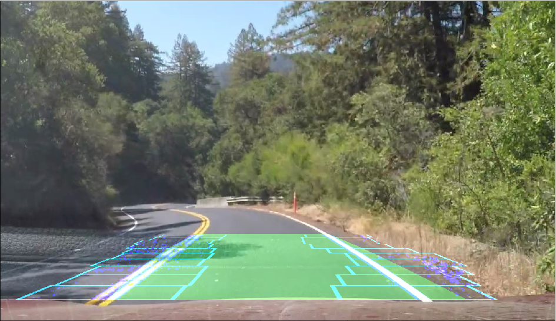

## Advanced Lane Finding

Overview
---
This repository contains files for the Advanced Lane Finding Project.

The goals / steps of this project are the following:

* Compute the camera calibration matrix and distortion coefficients given a set of chessboard images.
* Apply a distortion correction to raw images.
* Use color transforms, gradients, etc., to create a thresholded binary image.
* Apply a perspective transform to rectify binary image ("birds-eye view").
* Detect lane pixels and fit to find the lane boundary.
* Determine the curvature of the lane and vehicle position with respect to center.
* Warp the detected lane boundaries back onto the original image.
* Output visual display of the lane boundaries and numerical estimation of lane curvature and vehicle position.

To meet specifications, the project contains five files: 
* P4.ipynb (jpython notebook file with complete pipeline and explanations)
* a markdown report writeup file 

Folders "test_images", "hard_challenge_test_images", "challenge_test_images" contain test images from 3 of project videos which are used in ipynb file.

These are the links to my processed videos:

1. [Project video](https://youtu.be/iDbKAHjXzCI)
2. [Challenge video](https://youtu.be/yVQVdUi6FZY)
3. [Hard challenge video](https://youtu.be/7urmMT7tXiE)

### Dependencies
This lab requires:

* [CarND Term1 Starter Kit](https://github.com/udacity/CarND-Term1-Starter-Kit)

The lab enviroment can be created with CarND Term1 Starter Kit. Click [here](https://github.com/udacity/CarND-Term1-Starter-Kit/blob/master/README.md) for the details.

