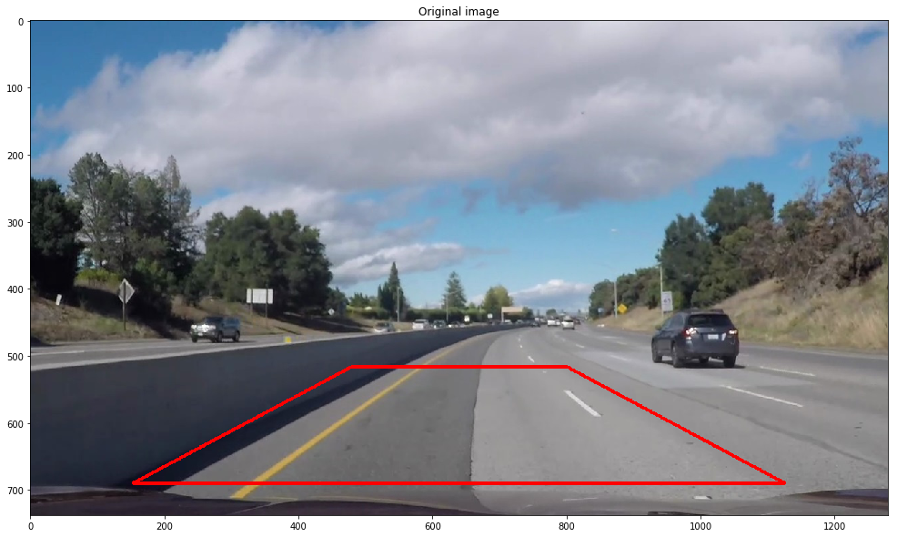
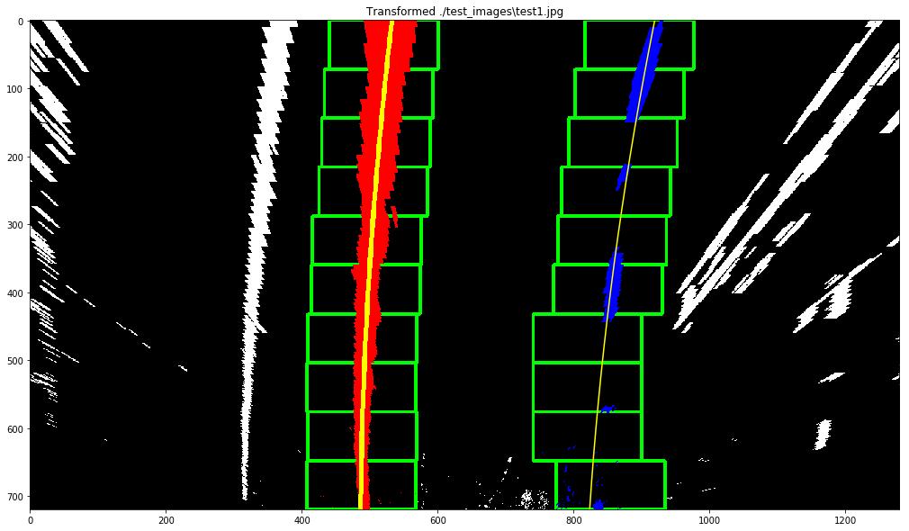
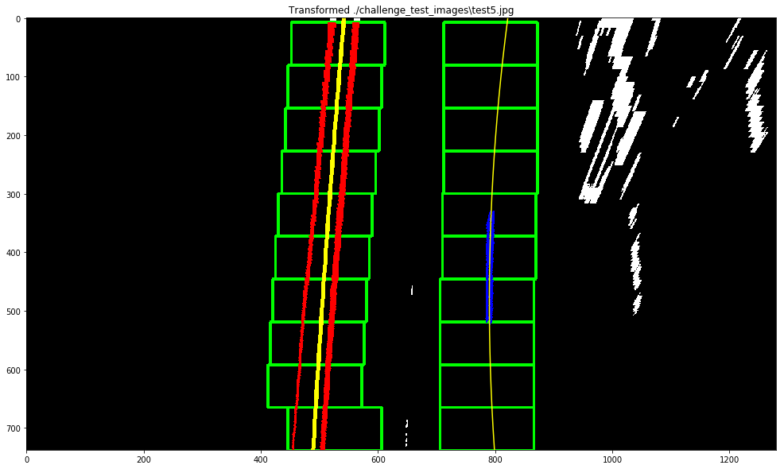
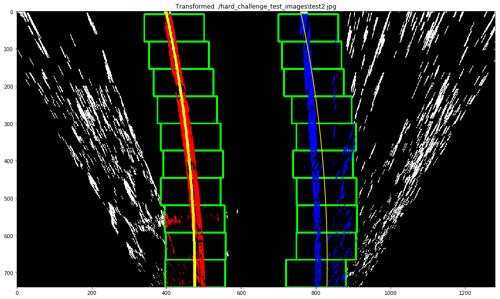
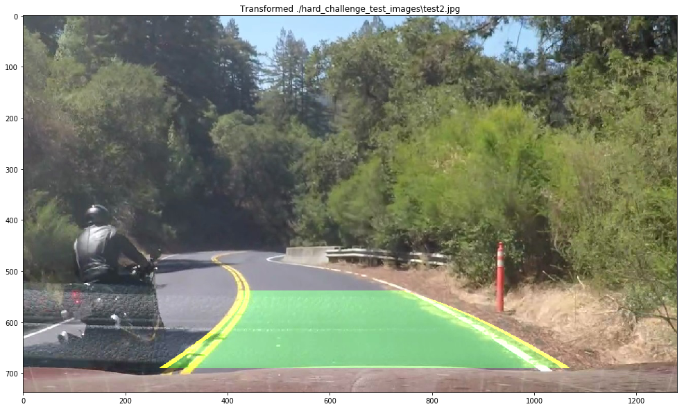

**Advanced Lane Finding Project**

## Built by Dmitry Zaganich in September 2017.

The goals / steps of this project are the following:

* Compute the camera calibration matrix and distortion coefficients given a set of chessboard images.
* Apply a distortion correction to raw images.
* Use color transforms, gradients, etc., to create a thresholded binary image.
* Apply a perspective transform to rectify binary image ("birds-eye view").
* Detect lane pixels and fit to find the lane boundary.
* Determine the curvature of the lane and vehicle position with respect to center.
* Warp the detected lane boundaries back onto the original image.
* Output visual display of the lane boundaries and numerical estimation of lane curvature and vehicle position.

## Rubric Points
### Here I will consider the [rubric points](https://review.udacity.com/#!/rubrics/571/view) individually and describe how I addressed each point in my implementation.  

---

### Camera Calibration

#### 1. Briefly state how you computed the camera matrix and distortion coefficients. Provide an example of a distortion corrected calibration image.

The code for this step is contained in the section "Step 1. Camera calibration" of the IPython notebook P4.ipynb  

I start by preparing "object points", which will be the (x, y, z) coordinates of the chessboard corners in the world. Here I am assuming the chessboard is fixed on the (x, y) plane at z=0, such that the object points are the same for each calibration image.  Thus, `objp` is just a replicated array of coordinates, and `obj_points` will be appended with a copy of it every time I successfully detect all chessboard corners in a test image.  `img_points` will be appended with the (x, y) pixel position of each of the corners in the image plane with each successful chessboard detection.  

Then in section "Step 2. Apply a distortion correction to raw images." I used the output `obj_points` and `img_points` to compute the camera calibration and distortion coefficients using the `cv2.calibrateCamera()` function.  I applied this distortion correction to the test image using the `cv2.undistort()` function and obtained this result: 

### Pipeline (single images)

#### 1. Provide an example of a distortion-corrected image.

I undistort an example image and compare it with the original version in section "Step 2. Apply a distortion correction to raw images.".

#### 2. Describe how (and identify where in your code) you used color transforms, gradients or other methods to create a thresholded binary image.  Provide an example of a binary image result.

The code for this rubric point is contained in section "Step 3. Thresholding". 

To successfully extract the lane from an image I need to threshold the image in such a way so lane lines will be clearly visible on the output image. I decided to combine pixels from the original image, which was transformed to the different color spaces to the pixels from an image generated by applying sobel operator to the original image in different directions.

I started with transformation of test images to the different color spaces and investigation of the result. I noticed that the lane lines have the hishest visibility in V channel of HSV color space and in S channel of HLS so I decided to use them in my pipeline. Then I implemented gradients with sobel operator. 
As a result: V, S channels and gradients were combined separately by applying "bitwise_and" and then I pierced them together with "bitwise_or" to the final threshold image. It resulted in a robust way of highlighting lane lines in the image.
The results of color thresholding, applying sobel operator and an example of final thresholded image are show below.

#### 3. Describe how (and identify where in your code) you performed a perspective transform and provide an example of a transformed image.

The code for this rubric point is contained in section "Step 4. Perspective transform" and it's represented by function "apply_pespective_transform(image)". 

I originally aimed to build one a single pipeline for all of the project videos, but these videos are quite different. The first and the easiest video contains road with mostly straight curve, but the second and especially the third have curved road with smaller horizon. In the second video camera's view blocked by a separator in the middle on the road and the third video contains recording of a small curved road in the forest. To capture information from this videos the pipeline should focus on the smaller portion of the road, the portion which is directly ahead of car. In order to do so, I needed to set up smaller trapezoids of source points in transformation function.
After playing with the parametres and researching how they were chosen by others I used parametres from the repo https://github.com/awbrown90/Advance-Lane-Finding.

I created 3 functions which allow me to quickly switch between different parametres in my project in section "Step 0. Imports, utils and settings"

gradx_thresh = 0 # gradient x threshold
grady_thresh = 0 # gradient y threshold
schannel_thresh = 0 # gradient s channel threshold
vchannel_thresh = 0 # gradient v channel threshold

bot_width = 0 # percent of bottom trapizoid height
mid_width = 0 # percent of middle trapizoid height
height_pct = 0 # percent for trapizoid height
bottom_trim = 0 # percent from top to bottom to avoid car hood

def enable_default_options():
    global gradx_thresh 
    global grady_thresh 
    global schannel_thresh 
    global vchannel_thresh 
    global bot_width 
    global mid_width 
    global height_pct 
    global bottom_trim 
    
    gradx_thresh = (25,255) 
    grady_thresh = (10,255) 
    schannel_thresh = (100,255) 
    vchannel_thresh = (200,255) 

    bot_width = .76 
    mid_width = .1 
    height_pct = .63 
    bottom_trim = .935 
    
def enable_challenge_options():
    global gradx_thresh 
    global grady_thresh 
    global schannel_thresh 
    global vchannel_thresh 
    global bot_width 
    global mid_width 
    global height_pct 
    global bottom_trim
    
    gradx_thresh = (20,255) 
    grady_thresh = (20,255) 
    schannel_thresh = (8,255) 
    vchannel_thresh = (160,255) 

    bot_width = .76 
    mid_width = .25 
    height_pct = .7 
    bottom_trim = .935 
    
def enable_challenge_options_backup():
    global gradx_thresh 
    global grady_thresh 
    global schannel_thresh 
    global vchannel_thresh 
    global bot_width 
    global mid_width 
    global height_pct 
    global bottom_trim
    
    gradx_thresh = (20,255) 
    grady_thresh = (20,255) 
    schannel_thresh = (8,255) 
    vchannel_thresh = (160,255) 

    bot_width = .76 
    mid_width = .25 
    height_pct = .7 
    bottom_trim = .935 

def enable_hard_challenge_options():  
    global gradx_thresh 
    global grady_thresh 
    global schannel_thresh 
    global vchannel_thresh 
    global bot_width 
    global mid_width 
    global height_pct 
    global bottom_trim
    
    gradx_thresh = (20,255) 
    grady_thresh = (20,255) 
    schannel_thresh = (240,255)
    vchannel_thresh = (240,255)

    bot_width = .76 
    mid_width = .3
    height_pct = .73
    bottom_trim = .935

The results of applying perspective transform to the images from different project videos are shown below: 

#### 4. Describe how (and identify where in your code) you identified lane-line pixels and fit their positions with a polynomial?

The code for this rubric point is contained in section "Step 5. Detect lane pixels and fit to find the lane boundary."

To isolate the lane lines I take a histogram (method "get_histogram(warped_image)") at the bottom of the image to identify where the lane lines start. In function "find_lane(image)" I use sliding window search and fit two polynomials to find lane lines as suggested in lectures. The result of identification of a lane in a warped test image is shown below:  

#### 5. Provide an example image of your result plotted back down onto the road such that the lane area is identified clearly.

The code for this rubric point is contained in section "Step 6. Warp the detected lane boundaries back onto the original image."

To warp detected lane lines on the original image I use inverse transformation matrix which is returned from "apply_pespective_transform" function. This is performed in function "def draw_lane(img, lane_lines_img, y_vals, left_x_vals, right_x_vals, Minv)". 

The results of identification of lanes in a test images from different videos are shown below: 

#### 6. Describe how (and identify where in your code) you calculated the radius of curvature of the lane and the position of the vehicle with respect to center.

The code for this rubric point is contained in section "Step 7. Determine the curvature of the lane, vehicle position and apply smoothing effect"

I this section I pierced my pipeline together into set of functions. The main function is "detect_lane_pipe" which takes an image and outputs an images with detected pipe, pipeline steps representations and curvature & vehicle position estimations. 

I used the same algorithm for curvature and vehicle position estimations as it was suggested in lectures. The functions to compute these values are defined as follows:

def get_curvature(y_to_fit, x_to_fit, y_eval):
    # Conversion factors for pixels to meters
    m_per_pix_y, m_per_pix_x = 30/720, 3.7/700
    
    # Fit a new polynomial to world-space (in meters)
    fit = np.polyfit(y_to_fit*m_per_pix_y, x_to_fit*m_per_pix_x, 2)
    curvature = ((1 + (2*fit[0]*(y_eval*m_per_pix_y) + fit[1])**2)**1.5) / np.absolute(2*fit[0])
    
    return curvature

def calc_offset(left_x, right_x, img_center_x):
    lane_width = abs(left_x - right_x)
    lane_center_x = (left_x + right_x)//2
    pix_offset = img_center_x - lane_center_x
    
    lane_width_m = 3.7  # How wide we expect the lane to be in meters
    return lane_width_m * (pix_offset/lane_width)

In order to perform a smooth processing of video files I average latest 3 detected lanes, which I store as objects of "Lane" class. I also compare every detected lane with previous detected lane to ensure that it did not change too much, because this will mean that the pipeline failed to detect lane on this frame.

The last function in my pipeline builds an output frame which contains frame with visible detected lane and it's boundaries, images of thresholding, trapezoid, birds-eye view and lane detection in warped state. It also outputs lane curvature and vehicle offset.

The result of applying a complete pipeline on a test image is shown below:

### Pipeline (video)

These are the links to my processed videos:

1. [Project video](https://youtu.be/iDbKAHjXzCI)
2. [Challenge video](https://youtu.be/yVQVdUi6FZY)
3. [Hard challenge video](https://youtu.be/7urmMT7tXiE)

---

### Discussion

#### 1. Briefly discuss any problems / issues you faced in your implementation of this project.  Where will your pipeline likely fail?  What could you do to make it more robust?

I was able to build a pipeline which performed well on the first video, and almost performed well on the challenge videos. 

However, I faced such issues as incorrect lane border detection in challenge videos, because sometimes oversaturation of road corners and straigh lines of a road boundary were mistaken with lane borders by algorithm. By analysing test images, which I exctracted from challenge videos, I was able to visually identify lanes on the "bird-eye" type of image, but histogram + polyfit method did not perform well, because it did not account the shape of the line. To improve this situation I can use some methods of shape detection, which I can then apply to all of the possible "starts of a line" in histogram and pick the best. It should remove some problems in video #3. 

I also faced an issue in a second video, where car enters dark area under a bridge. My pipeline failed to identify a lane there because the information was lost on a thresholding step. I think this issue might be fixed by detecting such "dark" places in frames and applying some additional filters.  
